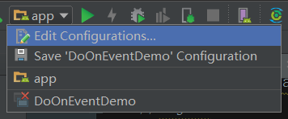
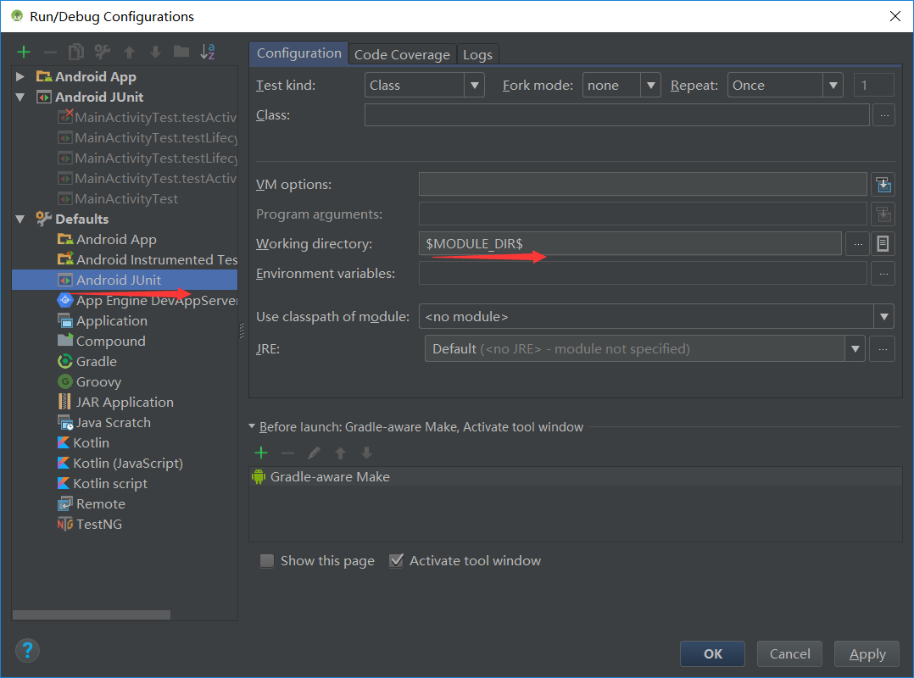
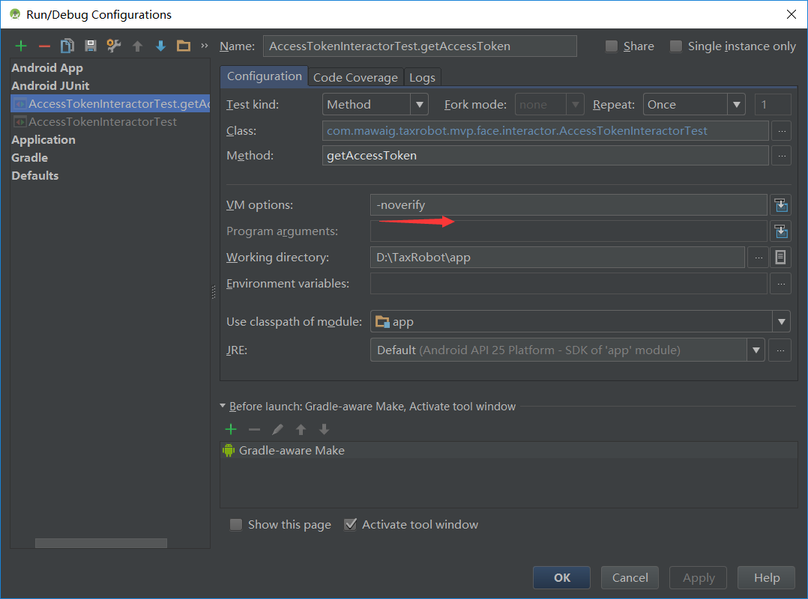
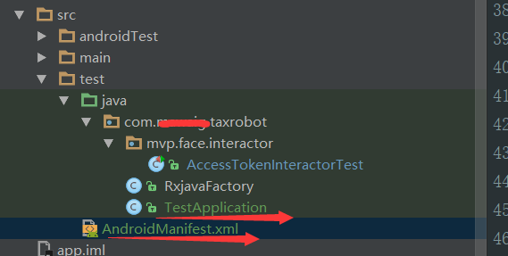

# Robolectric集成及各种bug解决方案

## 1.关于Robolectric
（ 参考博客：https://juejin.im/entry/5908244144d9040069381087 ）  
Robolectric通过实现一套JVM能运行的Android代码，然后在unit test运行的时候去截取android相关的代码调用，然后转到自己实现的代码去执行这个调用的过程。举个例子说明一下，比如Android里面有个类叫Button，Robolectric则实现了一个叫ShadowButton类。  这个类基本上实现了Button的所有公共接口。假设你在unit test里面写到
```
String text = button.getText().toString();
```
在这个unit test运行时，Robolectric会自动判断你调用了Android相关的代码button.getText()，在底层截取这个调用过程，转到ShadowButton的getText方法来执行。而ShadowButton是真正实现了getText这个方法的，所以这个过程便可以正常执行。

除了实现Android里面的类的现有接口，Robolectric还做了另外一件事情，极大地方便了unit testing的工作。那就是他们给每个Shadow类额外增加了很多接口，方便我们读取对应Android类的一些状态。比如ImageView有一个方法叫setImageResource(resourceId)，然而并没有一个对应的getter方法叫getImageResourceId()，这样你是没有办法测试这个ImageView是不是显示了你想要的image。而在  
Robolectric实现的ShadowImageView里面，则提供了getImageResourceId()这个接口，你可以用来测试它是否正确的显示了你想要的image。

## 2.配置
1）app的build.gradle的android节点下，添加
```
testOptions {
    unitTests {
        includeAndroidResources = true
    }
}
```    
2）测试类下注解配置(旧版本用的是@RunWith( RobolectricGradleTestRunner))
```
@RunWith(RobolectricTestRunner.class)
@Config(constants = BuildConfig.class)
public class ExampleRobolectricTestCase {
      ......
}
```
@Config(constants = BuildConfig.class)如今不设也行，暂时没见过影响测试结果的情况，但会报警告
```
WARNING: No manifest file found at .\AndroidManifest.xml.
Falling back to the Android OS resources only.
To remove this warning, annotate your test class with @Config(manifest=Config.NONE).
```
3）Working directory设置
如果在运行测试方法过程中遇见如下异常：
```
java.io.FileNotFoundException: build\intermediates\bundles\debug\AndroidManifest.xml
```
或者如下警告：
```
No such manifest file: build/intermediates/bundles/debug/AndroidManifest.xml
```
解决的方式就是将Working directory的值设置为$MODULE_DIR$。





## 3.Downloading: org/robolectric/android-all/7.1.0_r7-robolectric-0/android-all-7.1.0_r7-robolectric-0.jar from repository sonatype at https://oss.sonatype.org/content/groups/public/
解决办法：  
直接去网站下载：https://oss.sonatype.org/content/groups/public/  拼接上  org/robolectric/  
android-all/7.1.0_r7-robolectric-0/android-all-7.1.0_r7-robolectric-0.jar

扔到 C:\Users\lenovo\.m2\repository\org\robolectric\android-all\7.1.0_r7-robolectric-0

如果下载速度还是很慢，尝试一下：  
http://repo1.maven.org/maven2/  拼接上 org/robolectric/android-all/7.1.0_r7-robolectric-0  
/android-all-7.1.0_r7-robolectric-0.jar

扔到 C:\Users\lenovo\.m2\repository\org\robolectric\android-all\7.1.0_r7-robolectric-0

## 4.java.lang.UnsupportedOperationException: Robolectric does not support API level 26.

使用的Robolectric3.4版本，不支持API level 26，不支持API level15及以下的sdk版本

## 5.要测试v4包，需要org.robolectric:shadows-support-v4包

## 6.日志输出
只需要在每个TestCase的setUp()里执行ShadowLog.stream = System.out即可，这样，我们代码里的log，单元测试里的log都会输出到控制台，方便我们调试。如：
```
@Before
public void setUp() throws URISyntaxException {
  //输出日志
  ShadowLog.stream = System.out;
}
```

## 7.网络请求
Robolectic支持发送真实的网络请求，通过对响应结果进行测试，可大大的提升我们与服务端的联调效率。

## 8.测试网络时，遇到：
```
javax.net.ssl.SSLHandshakeException: sun.security.validator.ValidatorException: PKIX   
path validation failed: java.security.cert.CertPathValidatorException: Algorithm   
constraints check failed on signature algorithm: SHA256WithRSAEncryption
```
https://github.com/robolectric/robolectric/issues/3288
解决办法：  

1）
```
testImplementation 'org.robolectric:robolectric:3.4'
    //    testImplementation dependencies.create('org.robolectric:robolectric:3.4') {
//        exclude group: 'org.bouncycastle'
//    }
//    testImplementation dependencies.create('org.robolectric:robolectric-shadows:3.1') {
//        exclude group: 'org.bouncycastle'
//    }
    testImplementation 'org.bouncycastle:bcprov-jdk15on:1.57'  
```
2）https://github.com/robolectric/robolectric/issues/3288

## 9.java.lang.VerifyError: Expecting a stackmap frame at branch target 384
```
Exception Details:
  Location:
    cn/jpush/android/service/PushReceiver.<clinit>()V @11: goto
  Reason:
    Expected stackmap frame at this location.
  Bytecode:
    0x0000000: 1023 bd00 3c59 0312 1710 ffa7 0175 5359
    0x0000010: 0412 0b03 a701 6c53 5905 1216 04a7 0163
```
解决办法：  


## 10.Shadow Classes
Shadow classes always need a public no-arg constructor so that the Robolectric framework can instantiate them.

## 11.Robolectric的application，会走真实逻辑。如果你的application里做了几个别的第三方jar包，如讯飞语音的初始化，测试时，可能报类似的错。有什么办法替换真实的application，绕过去这一段初始化第三方jar包的代码吗？  

解决办法：
1）在test包下，新建一个AndroidManifest.xml,在该Manifest里，指定你新建的专门用于测试用的TestApplication。如：  

2）使用@config指定你的Manifest，路径为“src/test/AndroidManifest.xml”（你原来的Manifest路径为“src/main/AndroidManifest.xml”）如：
```
@RunWith(RobolectricTestRunner.class)
@Config(manifest = "src/test/AndroidManifest.xml")
```
这样，如果你在TestApplication的onCreate打印日志时，测试时，如果有用到Application的实例（没有用到，会出现onCreate不走的情况），就换发现，app原来的Application，已经被替换成了TestApplication。

注意：指定Manifest时，@Config不要再加上constants = BuildConfig.class  

不然会报警告：
```
No such manifest file: build\intermediates\manifests\full\debug\src\test\AndroidManifest.xml
```
3）其实吧...如果你只是单纯的想要一个干干净净的Application,也可以不用像上面那么复杂...
```
@RunWith(RobolectricTestRunner.class)
@Config(manifest=Config.NONE)
```

## 12.使用roboletric以上时，需要启用Java 8 语言功能和 Jack（已知问题：Instant Run 目前不能用于 Jack，在使用新的工具链时将被禁用。）
```
android {
  ...
  defaultConfig {
  ...
  jackOptions {
  enabled true
  }
  }
  compileOptions {
  sourceCompatibility JavaVersion.VERSION_1_8
  targetCompatibility JavaVersion.VERSION_1_8
  }
```
但启用Java8和Jack工具链可能导致项目乱码，  
解决办法：http://blog.csdn.net/ljh102/article/details/52916019

gradle.properties文件中添加：
```
org.gradle.jvmargs=-Dfile.encoding=UTF-8
```
然而，在实际项目里，还发现另一个问题，这样使用Jack工具链，会出现下述情况：
```
Warning:D:\TaxRobot\app\src\main\java\com\mawaig\taxrobot\customview\CameraSurfaceView.java:34.94: The type Camera.PreviewCallback is deprecated
Warning:D:\TaxRobot\app\src\main\java\com\mawaig\taxrobot\customview\CameraSurfaceView.java:93.46: The type Camera is deprecated
Warning:D:\TaxRobot\app\src\main\java\com\mawaig\taxrobot\customview\CameraSurfaceView.java:34.87: The type Camera is deprecated
Warning:D:\TaxRobot\app\src\main\java\com\mawaig\taxrobot\customview\CameraSurfaceView.java:41.13: The type Camera is deprecated
Warning:D:\TaxRobot\app\src\main\java\com\mawaig\taxrobot\customview\CameraSurfaceView.java:9.8: The type Camera is deprecated
......
Error:com.android.jack.frontend.FrontendCompilationException: Failed to compile
Error:Execution failed for task ':app:transformJackWithJackForDebug'.
> com.android.build.api.transform.TransformException: com.android.jack.api.v01.CompilationException: Failed to compile
```
咋办？最智障的做法，clean一遍代码，然后再跑，就发现能成功运行了。然后...一顿噼里啪啦，写了一段代码，再准备跑代码，你会发现，这样的错误又蹦了出来...总不能每次都clean一次代码再跑吧？

解决办法：使用第三方Java8兼容插件。参考博文：http://likfe.com/2016/07/06/android-setting-lamdba/  

1）移除
```
jackOptions {
  enabled true
}
```
2）在project的build.gradle下，添加
```
dependencies {
     classpath 'me.tatarka:gradle-retrolambda:3.7.0'
}
```
3）在app的build.gradle下，添加
```
apply plugin: 'me.tatarka.retrolambda'
```

## 13.测试rxjava2和retrofit2的网络请求框架时，（我测试一个获取H5的网页时，碰到过）断言testObserver.assertComplete()有时会报下面错误：
```
Caused by: java.lang.AssertionError
    at okhttp3.internal.platform.AndroidPlatform.isCleartextTrafficPermitted(AndroidPlatform.java:160)
    at okhttp3.internal.connection.RealConnection.connect(RealConnection.java:138)
    at okhttp3.internal.connection.StreamAllocation.findConnection(StreamAllocation.java:195)
    at okhttp3.internal.connection.StreamAllocation.findHealthyConnection(StreamAllocation.java:121)
    at okhttp3.internal.connection.StreamAllocation.newStream(StreamAllocation.java:100)
    at okhttp3.internal.connection.ConnectInterceptor.intercept(ConnectInterceptor.java:42)
    at okhttp3.internal.http.RealInterceptorChain.proceed(RealInterceptorChain.java:92)
    at okhttp3.internal.http.RealInterceptorChain.proceed(RealInterceptorChain.java:67)
    at okhttp3.internal.cache.CacheInterceptor.intercept(CacheInterceptor.java:93)
    at okhttp3.internal.http.RealInterceptorChain.proceed(RealInterceptorChain.java:92)
```
解决办法：  
@Config(sdk=23)  （sdk设置为23以上即可）  
不过还是有点缺陷，发现日志拦截器无法打印齐全html页面的源代码，但不影响测试。如果去除掉rxjava2，即只用retrofit2测试网络，没有碰到上述情况，日志也能打印齐全。如下：
.....
```
//(忽略预先设置的代码，当然，也不用使用@Config(sdk=23))
@Test
public void getUploadAddress() throws Exception {
    String robotid ="12345";
    Call<ResponseBody> call = mHttpService.getUploadAddress(robotid);
    Response<ResponseBody> response = call.execute();
    String string = response.body().string();
    Log.d(TAG, "getUploadAddress: json:"+string);
}
```

## 14.Robolectric unit tests fail after Multidex
```
testCompile "org.robolectric:shadows-multidex:3.4-rc2"
```

## 15.使用robolectric+powermock+dagger2时
```
java.lang.NullPointerException: appComponent
    at com.mawaig.taxrobot.injector.component.DaggerSplashComponent$Builder.appComponent(DaggerSplashComponent.java:121)
    at com.mawaig.taxrobot.mvp.splash.view.SplashActivity.inject(SplashActivity.java:62)
    at com.mawaig.taxrobot.mvp.splash.view.SplashActivity.initData(SplashActivity.java:52)
    at com.mawaig.taxrobot.base.mvp.BaseActivity.onCreate(BaseActivity.java:46)
    at android.app.Activity.performCreate(Activity.java:6679)
    at org.robolectric.util.ReflectionHelpers.callInstanceMethod(ReflectionHelpers.java:232)
    at org.robolectric.android.controller.ActivityController$1.run(ActivityController.java:73)
    at org.robolectric.shadows.ShadowLooper.runPaused(ShadowLooper.java:366)
```
原因与解决方案：不要在使用了robolectric和dagger2后，还使用powermock。  
参考资料：https://stackoverflow.com/questions/34692021/powermock-robolectric-dagger2-part-i

## 16. java.lang.annotation.AnnotationFormatError: Invalid default: public abstract java.lang.Class org.robolectric.annotation.Config.application()  
参考资料：https://github.com/robolectric/robolectric/issues/1620  
我似乎是通过删除  .gradle 然后重新编译就成功修复了。

